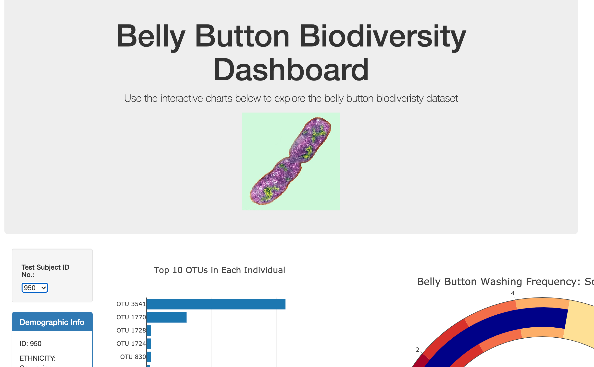
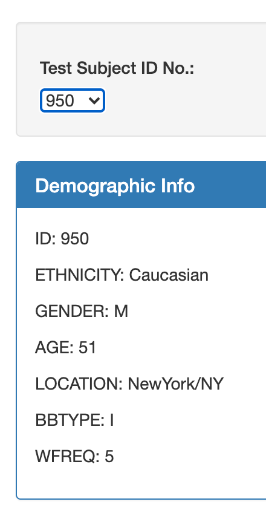
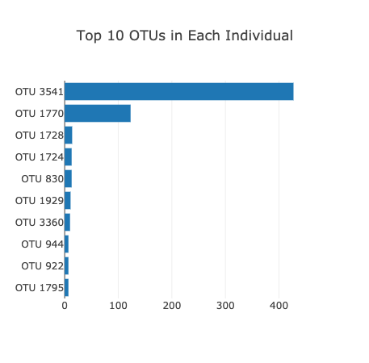
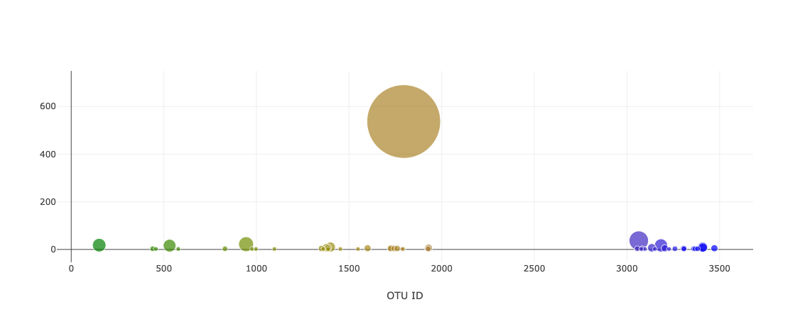
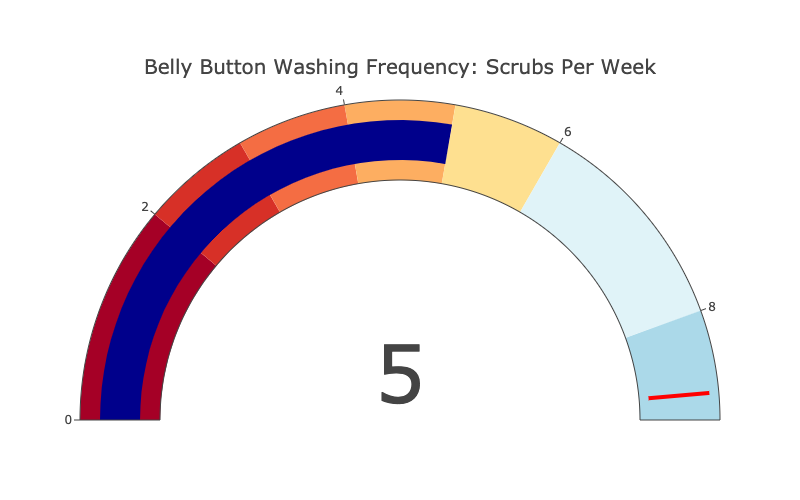

# Plot.ly Homework - Belly Button Biodiversity

This interactive dashboard explores the [Belly Button Biodiversity dataset](http://robdunnlab.com/projects/belly-button-biodiversity/), which catalogs the microbes that colonize human navels.

The dataset reveals that a small handful of microbial species (also called operational taxonomic units, or OTUs, in the study) were present in more than 70% of people, while the rest were relatively rare.

## Step 1: Plotly and D3

Plotly was used to create an interactive dashboard that uses the D3 library, data is a JSON object.

## Interactive Dashboard Features:

* A dropdown menu that: displays the sample metadata: an individual's demographic information and each key-value pair from the metadata JSON object.

* The horizontal bar chart that displays the top 10 OTUs found in each individual, when one hovers over each bar the bacteria names will appear.

* The bubble chart displays each sample, the size of the bubble is represented by the amount of bacteria per id

* Gauge Chart that shows the weekly washing frequency of the individual.

* All plots and metadata updates each time a new sample is selected.

### About the Data

Hulcr, J. et al.(2012) _A Jungle in There: Bacteria in Belly Buttons are Highly Diverse, but Predictable_. Retrieved from: [http://robdunnlab.com/projects/belly-button-biodiversity/results-and-data/](http://robdunnlab.com/projects/belly-button-biodiversity/results-and-data/)
